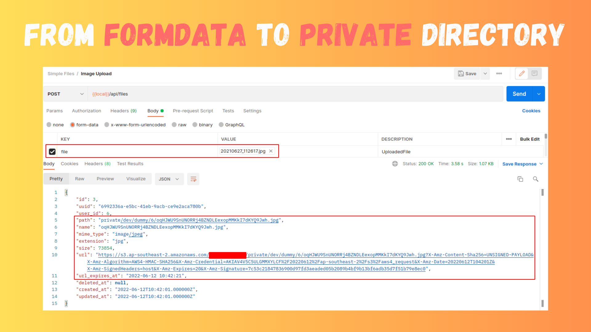
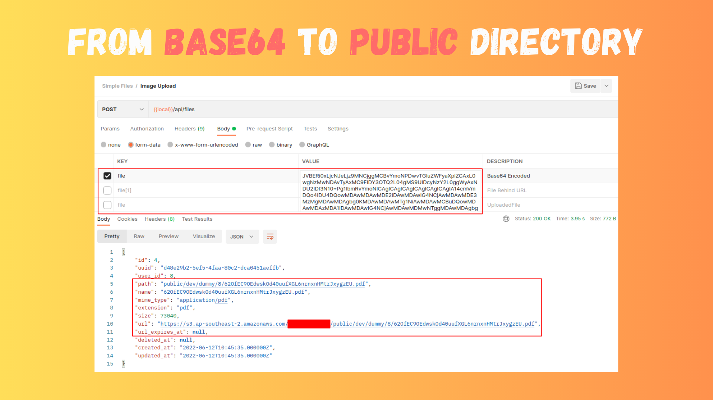
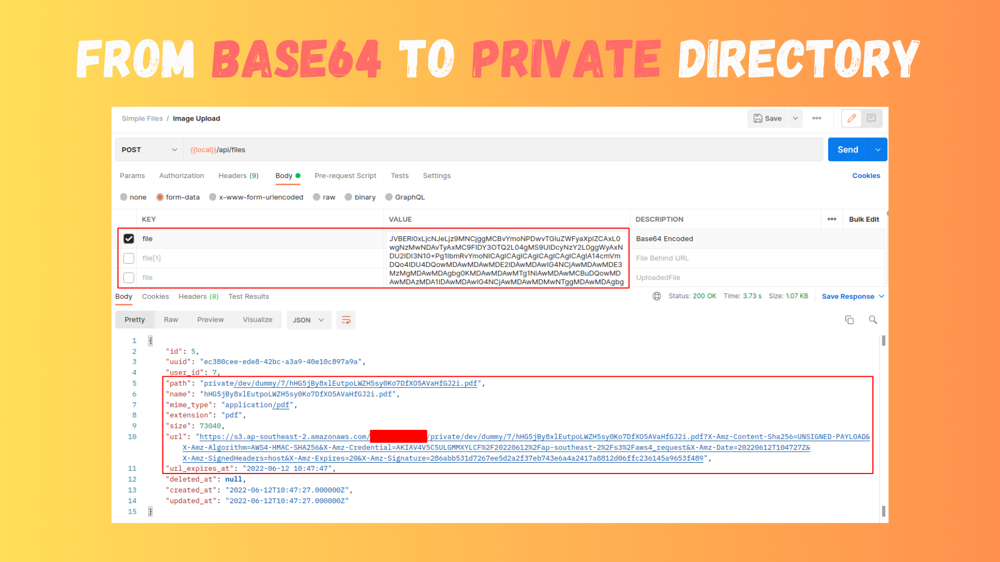
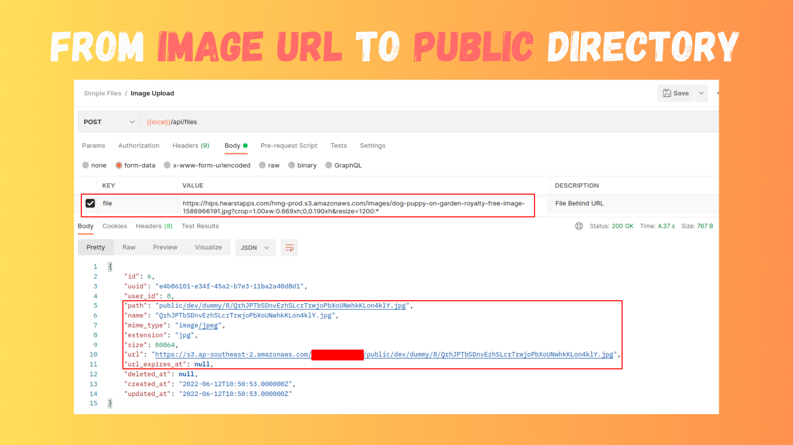
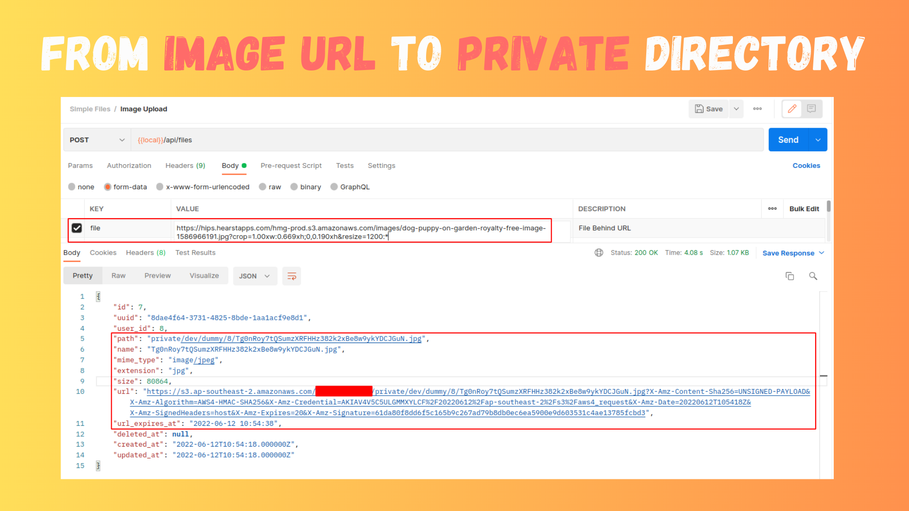
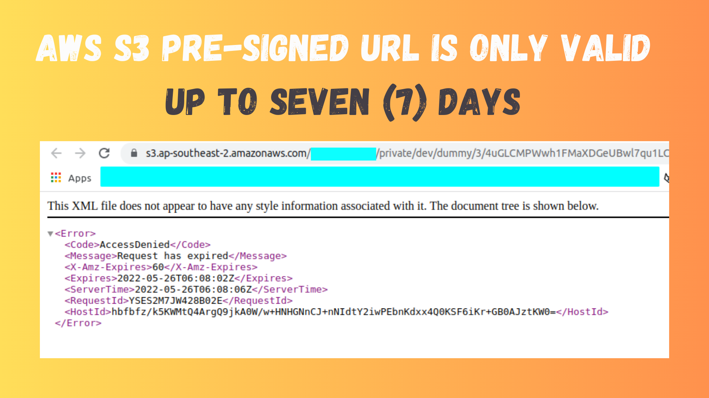

# Simple Files by James Carlo Luchavez


A lot of Laravel applications needs to work with files. There's a high chance that at least one **Eloquent model** in your project needs to have an image file. This package is built with that in mind so that you can proceed with more important things in your project. Check out the [examples](#examples) below to get a clearer picture.

Take a look at [contributing.md](contributing.md) if you want to contribute to this project.

## Installation

Via Composer

``` bash
$ composer require luchavez/simple-files:^1.0.0
```

## Setting Up

1. Add the [HasFilesTrait](src/Traits/HasFilesTrait.php) trait to all the Eloquent models that can own files.

2. Run the migrations to add the [**files**](database/migrations/2022_03_30_000000_create_files_table.php) and [**fileables**](database/migrations/2022_03_30_000002_create_fileables_table.php) tables.

3. Add these variables to `.env` file if you want to override the default values.

| Variable Name           | Default Value                   |
|-------------------------|---------------------------------|
| `SF_FILESYSTEM_DRIVER`  | `config('filesystems.default')` |
| `SF_EXPIRE_AFTER_UNIT`  | `days`                          |
| `SF_EXPIRE_AFTER_VALUE` | 1                               |
| `SF_PUBLIC_DIRECTORY`   | `public`                        |
| `SF_PRIVATE_DIRECTORY`  | `private`                       |


## Usage

### SimpleFiles

The package provides a service called [**SimpleFiles**](src/Services/SimpleFiles.php) which you can use by calling its [helper functions](helpers/simple-files-helper.php):
1. `simpleFiles()`
2. `simple_files()`

Here's the list of its available methods.

| Method Name              | Return Type                                     | Description                                                                        |
|--------------------------|-------------------------------------------------|------------------------------------------------------------------------------------|
| `getFileSystemDriver`    | `string`                                        | gets the filesystem driver                                                         |
| `getFileSystemAdapter`   | `Illuminate\Filesystem\FilesystemAdapter`       | gets the filesystem adapter                                                        |
| `getExpireAfterUnit`     | `string`                                        | gets the time unit for temporary URL expiration                                    |
| `getExpireAfterValue`    | `string`                                        | gets the time value for temporary URL expiration                                   |
| `getExpireAfter`         | `Illuminate\Support\Carbon`                     | gets the `Carbon` equivalent of `getExpireAfterUnit()` and `getExpireAfterValue()` |
| `getPublicDirectory`     | `string`                                        | gets the specified `public` directory                                              |
| `getPrivateDirectory`    | `string`                                        | gets the specified `private` directory                                             |
| `store`                  | `Luchavez\SimpleFiles\Models\File or array or null` | stores file/s to specified `public` or `private` directory                         |
| `storePublicly`          | `Luchavez\SimpleFiles\Models\File or array or null` | uses `store()` method with `$is_public` to `true`                                  |
| `storePrivately`         | `Luchavez\SimpleFiles\Models\File or array or null` | uses `store()` method with `$is_public` to `false`                                 |
| `getContentsFromURL`     | `string or null`                                | gets contents by using `file_get_contents()`                                       |
| `getContentsFromBase64`  | `string or null`                                | gets contents by using `base64_decode()`                                           |
| `getFiles`               | `array`                                         | gets files list from specified `public` or `private` directory                     |
| `getPublicFiles`         | `array`                                         | uses `getFiles()` method with `$is_public` to `true`                               |
| `getPrivateFiles`        | `array`                                         | uses `getFiles()` method with `$is_public` to `false`                              |
| `delete`                 | `bool`                                          | deletes file on specified path                                                     |
| `deleteFiles`            | `bool`                                          | deletes files from specified `public` or `private` directory                       |
| `deletePublicFiles`      | `bool`                                          | uses `deleteFiles()` method with `$is_public` to `true`                            |
| `deletePrivateFiles`     | `bool`                                          | uses `deleteFiles()` method with `$is_public` to `false`                           |
| `exists`                 | `bool`                                          | checks if file exists on specified path                                            |
| `relateFileModelTo`      | `void`                                          | dynamically build relationship from any model to the `File` model                  |
| `setIsFilePublicGuesser` | `void`                                          | override default logic that decided whether a `File` model is public or not        |
| `isFilePublic`           | `bool`                                          | checks if a `File` model is public or not                                          |

### HasFilesTrait

The package also provides [**HasFilesTrait**](src/Traits/HasFilesTrait.php) which you can use on Eloquent models that you want to have files or images.

- If a **User** model needs profile pictures...

```injectablephp
use Luchavez\SimpleFiles\Traits\HasFilesTrait;

class User extends Authenticatable
{
    use HasFactory, Notifiable, HasFilesTrait;
...
```
- Or, if a **Company** model needs logos...

```injectablephp
use Luchavez\SimpleFiles\Traits\HasFilesTrait;

class Company extends Model
{
    use HasFactory, HasFilesTrait;
...
```
- Or, if a **Food** model needs some Instagram-worthy images...
```injectablephp
use Luchavez\SimpleFiles\Traits\HasFilesTrait;

class Food extends Model
{
    use HasFactory, HasFilesTrait;
...
```

Here's the list of methods that will be added to Eloquent models.

| Method Name     | Return Type                                          | Description               |
|-----------------|------------------------------------------------------|---------------------------|
| `files`         | `Illuminate\Database\Eloquent\Relations\MorphToMany` | gets all files            |
| `images`        | `Illuminate\Database\Eloquent\Relations\MorphToMany` | gets all image files      |
| `nonImages`     | `Illuminate\Database\Eloquent\Relations\MorphToMany` | gets all non-image files  |
| `fileables`     | `Illuminate\Database\Eloquent\Relations\MorphMany`   | gets all fileables        |
| `fileable`      | `Illuminate\Database\Eloquent\Relations\MorphOne`    | gets latest fileable      |
| `imageables`    | `Illuminate\Database\Eloquent\Relations\MorphMany`   | gets all imageables       |
| `imageable`     | `Illuminate\Database\Eloquent\Relations\MorphOne`    | gets latest imageable     |
| `nonImageables` | `Illuminate\Database\Eloquent\Relations\MorphMany`   | gets all non-imageables   |
| `nonImageable`  | `Illuminate\Database\Eloquent\Relations\MorphOne`    | gets latest non-imageable |
| `attachFiles`   | `void`                                               | attaches file/s to model  |

## Examples

**Note**: In case you did not specify the user who uploaded the file, it will try to get the authenticated user via `auth()->user()`.

Here are the `.env` variables used in this example:

```dotenv
SF_FILESYSTEM_DRIVER=s3
SF_PUBLIC_DIRECTORY=public/dev/dummy
SF_PRIVATE_DIRECTORY=private/dev/dummy
SF_EXPIRE_AFTER_UNIT=minutes
SF_EXPIRE_AFTER_VALUE=2
```

### Uploading files

Let's start first by creating a public route `/api/files`. Use `storePublicly()` and `storePrivately()` methods of `simpleFiles()` global helper function to store the files on `public/dev/dummy` and `private/dev/dummy` directories respectively.

- Using `storePublicly()` with randomly selected `User` model as uploader.
```injectablephp
Route::post('/files', function (Request $request) {
    return simpleFiles()->storePublicly($request->file, \App\Models\User::query()->inRandomOrder()->first())->toArray();
});
```
- Using `storePrivately()` with randomly selected `User` model as uploader.
```injectablephp
Route::post('/files', function (Request $request) {
    return simpleFiles()->storePrivately($request->file, \App\Models\User::query()->inRandomOrder()->first())->toArray();
});
```

Once that is set up, we can use [Postman](https://www.postman.com/) to upload files to the route above.

- Here's an example of normal `FormData` file upload using `storePublicly()`.


- Here's an example of normal `FormData` file upload using `storePrivately()`.



- Here's an example of `Base64` encoded file upload using `storePublicly()`.



- Here's an example of `Base64` encoded file upload using `storePrivately()`.



- Here's an example of file upload from `URL` using `storePublicly()`.



- Here's an example of file upload from `URL` using `storePrivately()`.



**Note**: If you will open an expired url, you'll receive a `Request has expired` error.



### Attaching files

To attach an uploaded file to a model, use the `attachFiles()` method from [**HasFilesTrait**](#hasfilestrait).

- If a **User** model needs profile pictures...

```injectablephp
Route::post('/files', function (Request $request) {
    $file = simpleFiles()->storePublicly($request->file, \App\Models\User::query()->inRandomOrder()->first());
    
    \App\Models\User::find(1)->attachFiles($file);
    
    return $file->toArray();
});
```
- Or, if a **Company** model needs logos...

```injectablephp
Route::post('/files', function (Request $request) {
    $file = simpleFiles()->storePublicly($request->file, \App\Models\User::query()->inRandomOrder()->first());
    
    \App\Models\Company::find(1)->attachFiles($file);
    
    return $file->toArray();
});
```
- Or, if a **Food** model needs some Instagram-worthy images...
```injectablephp
Route::post('/files', function (Request $request) {
    $file = simpleFiles()->storePublicly($request->file, \App\Models\User::query()->inRandomOrder()->first());
    
    \App\Models\Food::find(1)->attachFiles($file);
    
    return $file->toArray();
});
```

## Change log

Please see the [changelog](changelog.md) for more information on what has changed recently.

## Testing

``` bash
$ composer test
```

## Contributing

Please see [contributing.md](contributing.md) for details and a todolist.

## Security

If you discover any security related issues, please email author@email.com instead of using the issue tracker.

## Credits

- [James Carlo S. Luchavez][link-author]
- [All Contributors][link-contributors]

## License

MIT. Please see the [license file](license.md) for more information.

[ico-version]: https://img.shields.io/packagist/v/luchavez/simple-files.svg?style=flat-square
[ico-downloads]: https://img.shields.io/packagist/dt/luchavez/simple-files.svg?style=flat-square
[ico-travis]: https://img.shields.io/travis/luchavez/simple-files/master.svg?style=flat-square
[ico-styleci]: https://styleci.io/repos/12345678/shield

[link-packagist]: https://packagist.org/packages/luchavez/simple-files
[link-downloads]: https://packagist.org/packages/luchavez/simple-files
[link-travis]: https://travis-ci.org/luchavez/simple-files
[link-styleci]: https://styleci.io/repos/12345678
[link-author]: https://github.com/luchmewep
[link-contributors]: ../../contributors
